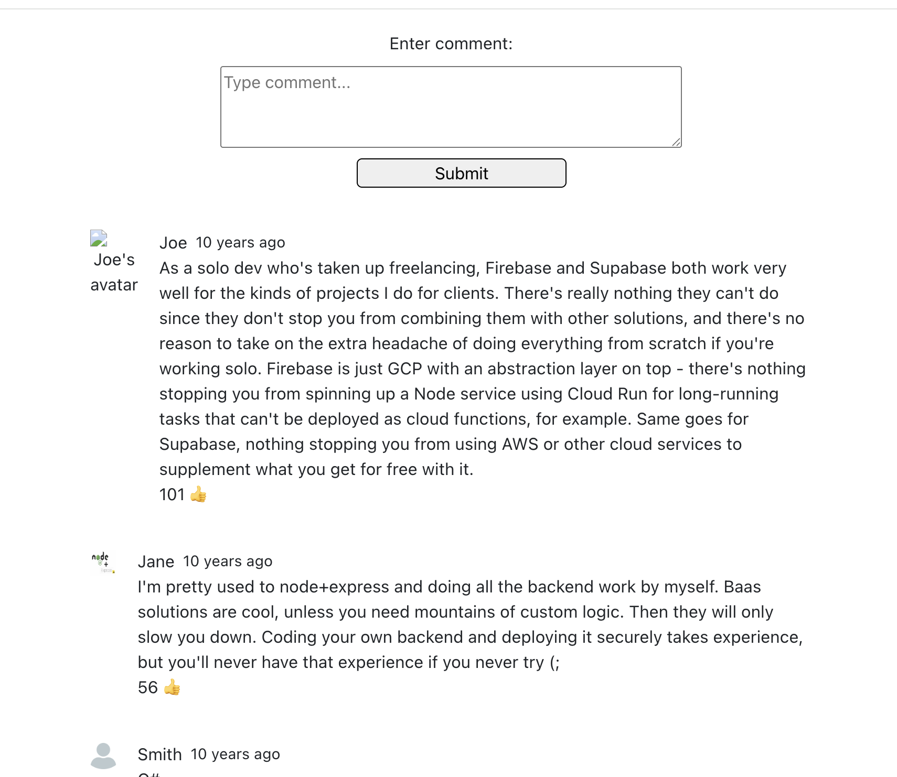

## Install

1. Run frontend local build
FE runs on http://localhost:5173
```
cd bobyard/bobyard-fe
npm install
npm run dev
```

2. Run backend local server
BE runs on http://localhost:3001. On first run, seed data will populate bobyard.db.
```
cd bobyard/bobyard-server
npm install
node server.js
```



